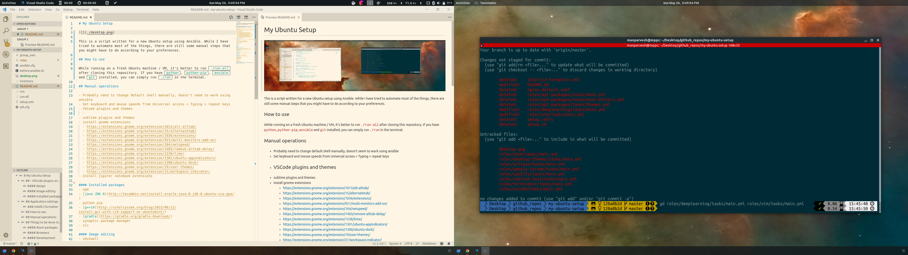

# My Ubuntu Setup

This is a script written for a new Ubuntu setup using Ansible. While I have tried to automate most of the things, there are still some manual steps that you might have to do according to your preferences.

## How to use

1. Edit the `setup.yml` file in this repository and un-comment all the items you want to install to your machine.
2. While running on a fresh Ubuntu machine / VM, it's better to run `./run-all` after cloning this repository. If you have `python`, `python-pip`, `ansible` (>=2.8) and `git` installed, you can simply run `./run` in the terminal.

## Manual operations

- Probably need to change default shell manually, doesn't seem to work using ansible
- Set keyboard and mouse speeds from Universal access > Typing > repeat keys
- VSCode plugins and themes
  - Material theme
  - Markdown all in one
  - LaTeX workshop
  - Ansible
  - Go
- sublime plugins and themes
  - Materialize
  - Materialize Appicons
- install gnome extensions
  - https://extensions.gnome.org/extension/1013/alt-alttab/
  - https://extensions.gnome.org/extension/15/alternatetab/
  - https://extensions.gnome.org/extension/1036/extensions/
  - https://extensions.gnome.org/extension/921/multi-monitors-add-on/
  - https://extensions.gnome.org/extension/104/netspeed/
  - https://extensions.gnome.org/extension/1403/remove-alttab-delay/
  - https://extensions.gnome.org/extension/1238/time/
  - https://extensions.gnome.org/extension/1301/ubuntu-appindicators/
  - https://extensions.gnome.org/extension/1300/ubuntu-dock/
  - https://extensions.gnome.org/extension/19/user-themes/
  - https://extensions.gnome.org/extension/21/workspace-indicator/
- Install jupyter notebook extensions

## Things that you can install using this script

- deeplearning: deep learning setup for machines with GPUs
  - anaconda
  - nvdia GPU driver
  - tensorflow-gpu
  - keras
- programming languages
  - java
  - Golang
- Ubuntu aliases
- text editors:
  - vim
  - atom
  - vscode
  - sublime text
  - notepad++
- web browsers
  - google chrome
  - brave
- cloud
  - docker
  - kubectl
  - minikube
  - microk8s
  - aws-cli
- design
  - gravit-designer
  - darktable
  - gimp
  - inkscape
  - polarr
- devtools
  - anaconda
  - nodejs
  - latex
  - postman
  - eclipse
  - git
  - jetbrains toolbox
  - jupyter
  - vagrant
- themes and stuff
  - desktop themes
  - gnome desktop
- utilities
  - gparted
  - shutter
  - skype
  - slack
  - snap store
  - virtualbox
- enternainment
  - spotify
  - vlc
- terminal
  - terminator
  - zsh

## TODO

- pandoc
- SimpleScreenRecorder
- foxit reader
- plantUML
- vscode extensions:
  - ansible
  - material theme
  - LaTeX workshop
  - markdown all in one
  - todo++
  - vscode-pandoc
  - window colors
- cuda 10.2
